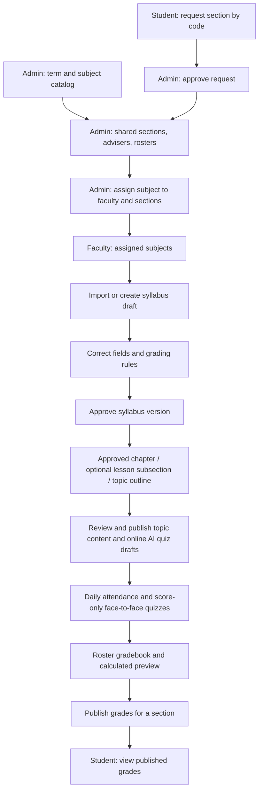

# Current academic and faculty workflow

The revised `proposed_new_flow.png` guides this implementation. The capstone PDF documents the earlier proposal and is retained for reference. The current [ERD](docs/diagrams/ERD.md), [DFD](docs/diagrams/DFD.md), and [capstone alignment](CAPSTONE_ALIGNMENT.md) provide the manuscript-ready changes.



## Ownership and progression

Admin creates a school year/semester, subject catalog entries, and sections with a year level, adviser, and join code on separate pages. A section has one home roster for the term. Assigning a subject and faculty member to one or more teaching sections creates an offering (`class`), and roster members normally receive the assigned subjects. For an irregular student, admin can persistently exempt one home-section subject or include a subject taught in another section. That student appears in the chosen teaching section's faculty roster, attendance, quizzes, and gradebook. Prior enrollment and publication snapshots remain in history. A student can request membership using the section code; only admin approval adds the student to the roster. Faculty class creation and manual enrollment return HTTP 403.

Faculty see their assigned offerings on the dashboard and assigned subjects page. Each offering has one shared syllabus. Import accepts DOCX or text based PDF; extracted details, outcomes, chapters, topics, assessments, references, materials, and grading rules become an editable draft. The importer reports uncertain fields and pages without text. Faculty must acknowledge warnings and approve the corrected draft. Approval makes a version available for DOCX or PDF export with GMVCC presentation. Its approved outline is chapter → optional lesson subsection → topic; a topic can also sit directly under a chapter. Moving or removing a place with linked content or quizzes requires reassignment before approval. Students see the approved outline with coming-soon labels. Topic PDF extraction and formatted manual content require faculty review before publication. Faculty can set item visibility and due date for each teaching section.

AI-generated online quizzes use published Learning Materials and External References attached to the selected placement. The backend reads linked reference pages before generating a configurable mix of multiple-choice and identification questions; an unreadable page stops generation. Faculty reviews and publishes each draft. Face-to-face quizzes have a date, title, maximum points, and manually entered scores; they have no online attempt. A quiz's course/chapter/subsection/topic placement is separate from its teaching-section audience. Offline quiz scores stay hidden from students until faculty publishes the corresponding grades.

The approved syllabus holds attendance, quiz, activity, and exam category weights; midterm/finals shares; raw or sample 50 + 50 × percentage transmutation; a passing threshold; and Late attendance credit (default 50%). Both weight sets must total 100. Faculty creates one attendance record per date and teaching section. Its unsaved draft marks everyone Present, then faculty explicitly saves or changes marks to Absent, Late, or Excused. Excused dates leave the attendance denominator. The roster gradebook shows students as rows and assessments as columns on wide screens, or one assessment's student list on phones. Blank is Pending and explicit zero is zero. Manual columns, attendance, quizzes, activities, and exams feed the grade preview. Faculty publishes a section's midterm, finals, or course snapshot explicitly. Student grade reads use only the published snapshot. New syllabus approval and score or enrollment changes invalidate affected publications, requiring review and publication again.

## Data model

```mermaid
erDiagram
  academic_term ||--o{ section : contains
  academic_term ||--o{ class : schedules
  subject_catalog ||--o{ class : identifies
  teacher ||--o{ class : teaches
  teacher ||--o{ section : advises
  section ||--o{ section_member : roster
  student ||--o{ section_member : belongs
  class ||--o{ class_section : assigned
  section ||--o{ class_section : receives
  class ||--o{ enrollment : legacy_and_delivery
  student ||--o{ subject_enrollment_exception : has
  class ||--o{ subject_enrollment_exception : overrides
  class ||--o{ attendance_session : schedules
  attendance_session ||--o{ attendance_mark : records
  class ||--o{ learning_content : contains
  class ||--o{ learning_resource : contains
  class ||--o{ activity : assigns
  class ||--o{ quiz : assesses
  class ||--o{ grade_publication_history : archives
  class ||--o{ syllabus_version : versions
  syllabus_version ||--o{ grade_publication : used_by
  section ||--o{ grade_publication : published_for
  class ||--o{ syllabus_section_override : controls
  class ||--o{ syllabus_item_link : links_topics
```

`class`, `enrollment`, original `syllabus`, uploads, submissions, and score tables retain their IDs and records. `section_member` is the shared roster source. `enrollment` remains the delivery join for existing screens and is synchronized from the roster. Existing classes begin in `legacy_review`; admin explicitly maps their old sections to shared sections and selects term and subject before activation. The review queue prevents uncertain historical records from appearing as current faculty assignments. Promotion to a new year and broader admin operations are outside this phase.

## Known boundaries

This phase follows the existing account model in which browser requests supply user, teacher, or student IDs; it does not introduce token based authorization. Existing legacy grading screens and records remain for historical classes, while active assigned offerings use the approved syllabus preview and publication path. Text extraction cannot recover scanned PDF pages; faculty must fill those fields in the editor.

## Chapter content and assessment workflow

The approved syllabus remains the source of chapter, optional lesson subsection, and topic keys. The faculty content workspace uses a compact outline and detail pane. A chapter can have several lesson modules; each module covers the whole chapter. Faculty can attach references (citation/title and optional URL) and downloadable learning materials to chapters or topics. Supported learning files are PDF, DOCX, PPTX, PNG, and JPEG up to 20 MB. A topic can also hold reviewed manual HTML or PDF-extracted text. Lessons, references, materials, and topic content begin as drafts and become student-visible only after faculty publication. The editor supports headings, bold, italic, lists, links, undo/redo, and plain-text paste. Published HTML is sanitized server-side.

Activities have online-submission and offline score-only types. Quizzes have AI-generated online and face-to-face score-only types. Each activity or quiz has exactly one content placement (course, chapter, lesson subsection, or topic), while its teaching-section audience is configured separately. Contextual Add actions in the outline prefill placement; the central Activities & Quizzes table handles creation, review, publication, and offline activity scores. AI quiz generation reads attached published materials and reference pages; the generated questions remain a faculty draft until published. Students see offline titles but submit no online attempt, and scores remain governed by grade publication.

The legacy Syllabus Progress stepper measured old chapter module coverage, not student progress. It has been removed from faculty and student subject pages. Historical module uploads are linked to approved chapters only when their old chapter title matches a unique approved chapter title; unmatched modules are listed for faculty review with files retained. Student subject offerings are labeled by teaching section, term, and faculty. An offering without an approved syllabus shows a pending faculty approval state to students. Archived offerings are omitted from the current student subject list.

The shared design system adds search, status filtering when applicable, and 10/25/50-row pagination to data tables. API writes show toasts and disable their action while pending; API reads show a shared loading bar. Listing tables remain horizontally scrollable on phones.
