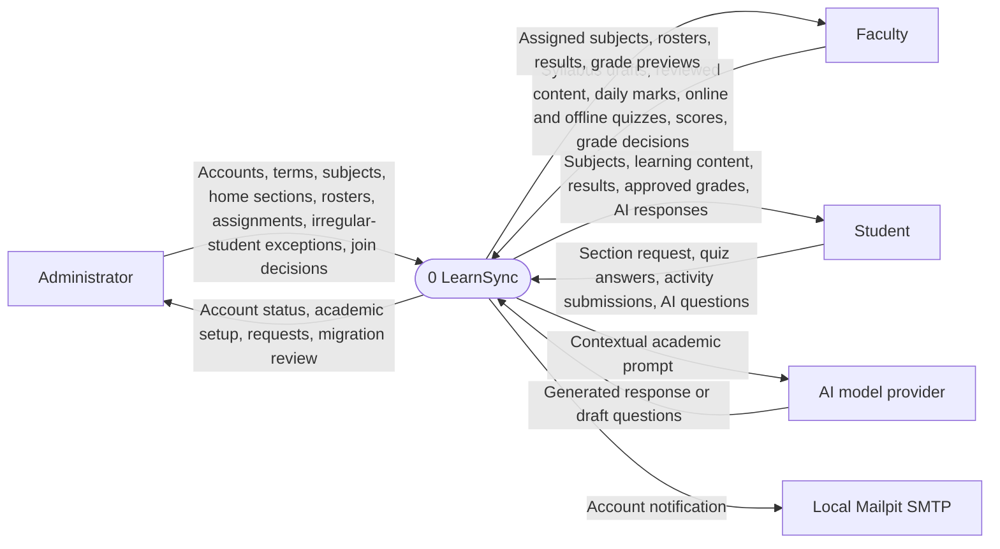

# Updated LearnSync data flow diagrams

These diagrams replace the proposal's context diagram (Figure 3.4) and teacher DFD (Figure 3.6) for the revised faculty flow. Rectangles name external actors, rounded nodes name processes, and cylinders name data stores. Labels on arrows identify the data exchanged.

## Context diagram

## Level 1 DFD: academic setup and faculty delivery

```mermaid
flowchart LR
    Admin[Administrator]
    Faculty[Faculty]
    Student[Student]
    AI[AI model provider]

    P1([1 Manage accounts])
    P2([2 Set up term, roster, and assignments])
    P3([3 Review and approve syllabus])
    P4([4 Manage learning content and assessments])
    P5([5 Receive submissions and record scores])
    P6([6 Preview and publish grades])
    P7([7 Answer academic query])

    D1[(D1 Accounts)]
    D2[(D2 Terms, subjects, sections, rosters, offerings)]
    D3[(D3 Syllabus versions and section settings)]
    D4[(D4 Materials, activities, quizzes)]
    D5[(D5 Submissions and scores)]
    D6[(D6 Grade publications)]
    D7[(D7 AI queries and module context)]

    Admin -->|Account details| P1
    P1 -->|Validated record| D1
    D1 -->|Account status| P1
    P1 -->|User record| Admin

    Admin -->|Term, subject, section, adviser, roster, assignment, student exception| P2
    Student -->|Section code request| P2
    P2 -->|Pending request| Admin
    Admin -->|Approval or rejection| P2
    P2 -->|Shared roster, exception, teaching-section enrollment and history| D2
    D2 -->|Assigned subjects, roster, join status| P2
    P2 -->|Assigned subjects and students| Faculty
    P2 -->|Assigned subjects and join status| Student

    Faculty -->|DOCX or PDF, corrected chapter/subsection/topic outline and grading rules| P3
    P3 -->|Draft and approved rule version| D3
    D3 -->|Warnings, draft, approved syllabus, exports| P3
    P3 -->|Review result and export| Faculty

    Faculty -->|Chapter lessons, citation links, uploaded files, reviewed PDF text, activity and quiz drafts, placement, audience, publication| P4
    D3 -->|Approved topics and section settings| P4
    P4 -->|Draft and published content and assessments| D4
    D4 -->|Available section content| P4
    P4 -->|Learning content and assessments| Student

    Student -->|Quiz answers and activity submissions| P5
    Faculty -->|Daily Present/Absent/Late/Excused marks, offline quiz, activity, and exam scores| P5
    D4 -->|Quiz answer key and activity specification| P5
    P5 -->|Submissions and assessed scores| D5
    P5 -->|Quiz or submission result| Student

    D3 -->|Approved grading rule| P6
    D5 -->|Recorded scores| P6
    D2 -->|Section roster| P6
    P6 -->|Calculated preview| Faculty
    Faculty -->|Publish decision| P6
    P6 -->|Versioned section snapshot| D6
    D6 -->|Published grade snapshot| P6
    P6 -->|Published grades only| Student

    Student -->|Question| P7
    D4 -->|Teacher learning material| P7
    P7 -->|Query and cited context| D7
    P7 -->|Contextual prompt| AI
    AI -->|Generated answer| P7
    P7 -->|Answer| Student
```

The data stores correspond to PostgreSQL tables and uploaded files, rather than seven new tables. D2 includes `academic_term`, `subject_catalog`, `section`, `section_member`, `class`, `class_section`, `enrollment`, `enrollment_request`, `subject_enrollment_exception`, and `subject_enrollment_history`. D3 includes `syllabus_version`, `syllabus_item_link`, and `syllabus_section_override`. D4 includes `learning_content`, `learning_resource`, historical modules, activities, and quizzes. D5 includes quiz scores, activity submissions, `attendance_session`, `attendance_mark`, and manual grading scores. D6 includes `grade_publication` and its history. A syllabus rule, enrollment, or score change invalidates the affected publication until faculty reviews and publishes again.
